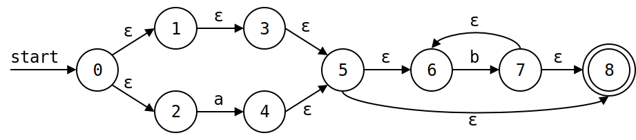
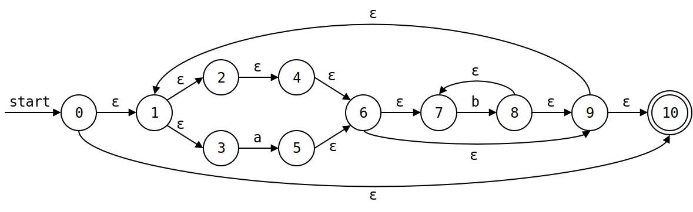
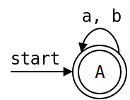

# 编译原理 第 3 章 作业 2

## 练习 1
为下面的语言设计一个 DFA 或 NFA
1) 包含 5 个元音的所有小写字母串，这些串中的元音按顺序出现
2) 所有由 a 和 b 组成且不含子串 `abb` 的串

### 解
1. 一个可能的 DFA 如下：
   
   

   其中 `char` 为 `bcdfghjklmnpqrstvwxyz` 中的字母。

2. 一个可能的 NFA 如下：
   
   

   一个可能的 DFA 如下：
   
   

## 练习 2
用算法 3.22 模拟图 3-29 中的 NFA 在处理输入 `aabb` 时的过程。

### 解

| #    | $S$                                                                          | $c$            | $c \neq \mathbf{eof}$ |
| :--- | :--------------------------------------------------------------------------- | :------------- | :-------------------- |
| 0    | $\epsilon\text{-}closure(0) = \{0\}$                                         | $\mathtt{a}$   | $\mathbf{false}$      |
| 1    | $\epsilon\text{-}closure(move(\{0\}, \mathtt{a})) = \{0, 1\}$                | $\mathtt{a}$   | $\mathbf{false}$      |
| 1    | $\epsilon\text{-}closure(move(\{0, 1\}, \mathtt{a})) = \{0, 1, 2\}$          | $\mathtt{b}$   | $\mathbf{false}$      |
| 1    | $\epsilon\text{-}closure(move(\{0, 1, 2\}, \mathtt{b})) = \{0, 1, 2, 3\}$    | $\mathtt{b}$   | $\mathbf{false}$      |
| 1    | $\epsilon\text{-}closure(move(\{0, 1, 2, 3\}, \mathtt{b})) = \{0, 1, 2, 3\}$ | $\mathbf{eof}$ | $\mathbf{true}$       |

由于，$S \cap F = \{3\} \neq \emptyset$，于是，$\mathbf{return}\ \mathtt{"yes"}$。

## 练习 3

使用算法 3.23 和 3.20 将下述正则表达式转换为 DFA，并尝试化简该 DFA。
1) `((ε|a)b*)*`  
2) `(a|b)*abb(a|b)*`

### 解

1). `((ε|a)b*)*`

用算法 3.23 转换为 NFA 的过程：

1. `(ε|a)` 的 NFA：

   

2. `b*` 的 NFA：

   

3. `(ε|a)b*` 的 NFA：

   

最终，`((ε|a)b*)*` 的 NFA：

用算法 3.20 将 NFA 转化为 DFA 的过程：

转化表如下：
|            NFA STATE             | DFA STATE |  $a$  |  $b$  |
| :------------------------------: | :-------: | :---: | :---: |
| $\{0, 1, 2, 3, 4, 6, 7, 9, 10\}$ |    $A$    |  $B$  |  $C$  |
| $\{1, 2, 3, 4, 5, 6, 7, 9, 10\}$ |    $B$    |  $B$  |  $C$  |
| $\{1, 2, 3, 4, 6, 7, 8, 9, 10\}$ |    $C$    |  $B$  |  $C$  |

得到的 DFA 如下：

 

经过化简，得到的 DFA 如下：

 

2). `(a|b)*abb(a|b)*`

用算法 3.23 转换为 NFA 的过程：

1. `(a|b)*` 的 NFA：
   
   

2. `abb` 的 NFA：
   
   

最终，`(a|b)*abb(a|b)*` 的 NFA：

用算法 3.20 将 NFA 转化为 DFA 的过程：

转化表如下：
|                              NFA STATE                               | DFA STATE |  $a$  |  $b$  |
| :------------------------------------------------------------------: | :-------: | :---: | :---: |
|                    <!--0, -->$\{0, 1, 2, 3, 7\}$                     |    $A$    |  $B$  |  $C$  |
|                <!--4, 8, -->$\{1, 2, 3, 4, 6, 7, 8\}$                |    $B$    |  $B$  |  $D$  |
|                   <!--5, -->$\{1, 2, 3, 5, 6, 7\}$                   |    $C$    |  $B$  |  $C$  |
|                <!--5, 9, -->$\{1, 2, 3, 5, 6, 7, 9\}$                |    $D$    |  $B$  |  $E$  |
|       <!--5, 10, -->$\{1, 2, 3, 5, 6, 7, 10, 11, 12, 13, 17\}$       |    $E$    |  $F$  |  $G$  |
|  <!--4, 8, 14, -->$\{1, 2, 3, 4, 6, 7, 8, 11, 12, 13, 14, 16, 17\}$  |    $F$    |  $F$  |  $H$  |
|     <!--5, 15, -->$\{1, 2, 3, 5, 6, 7, 11, 12, 13, 15, 16, 17\}$     |    $G$    |  $F$  |  $G$  |
|  <!--5, 9, 15, -->$\{1, 2, 3, 5, 6, 7, 9, 11, 12, 13, 15, 16, 17\}$  |    $H$    |  $F$  |  $I$  |
| <!--5, 10, 15, -->$\{1, 2, 3, 5, 6, 7, 10, 11, 12, 13, 15, 16, 17\}$ |    $I$    |  $F$  |  $G$  |

得到的 DFA 如下：

 

经过化简，得到的 DFA 如下：

 