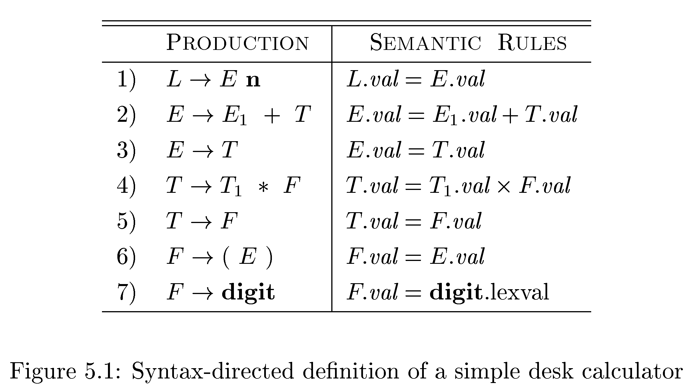
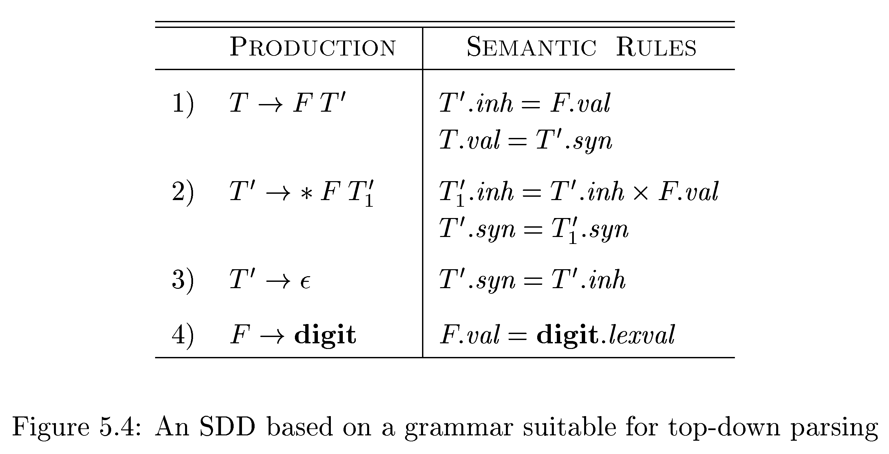

# 编译原理 第 5 章 作业 1

## 1
(1) 扩充图 5-4 中的 SDD，使它可以像图 5-1 所示的那样处理表达式。

(2) 使用扩充后得到的 SDD，给出表达式 $\mathtt{3 * ( 4 + 5 )} \mathbf{n}$ 对应的注释语法分析树。

### 解

(1) 扩充图 5-4 中的 SDD：图 5-4 中的 SDD 相较于图 5-1 中的 SDD，缺少了加法表达式和括号。补充后的 SDD 如下：

| 产生式                     | 语法规则 |
| :------------------------- | :------- |
| 1) $L  \to E \ \mathbf{n}$ | $L.val = E.val$ |
| 2) $E  \to T \ E'$         | $E'.inh = T.val \\ E.val = E'.syn$ |
| 3) $E' \to + \ T \ E'_1$   | $E'_1.inh = E'.inh + T.val \\ E'.syn = E'_1.syn$ |
| 4) $E' \to \varepsilon$    | $E'.syn = E'.inh$ |
| 5) $T  \to F \ T'$         | $T'.inh = F.val \\ T.val = T'.syn$ |
| 6) $T' \to * \ F \ T'_1$   | $T'_1.inh = T'.inh \times F.val \\ T'.syn = T'_1.syn$ |
| 7) $T' \to \varepsilon$    | $T'.syn = T'.inh$ |
| 8) $F  \to ( \ E \ )$      | $F.val = E.val$ |
| 9) $F  \to \mathbf{digit}$ | $F.val = \mathbf{digit}.lexval$ |

 

(2) $\mathtt{3 * ( 4 + 5 )} \mathbf{n}$ 对应的注释语法分析树如下：

<!-- $L.val = 27$  
$E.val = 27$ $\mathbf{n}$  
$T.val = 27$ $E'.inh = 27\\E'.syn = 27$  
$F.val = 3$ $T'.inh = 3\\T'.syn = 27$ $\varepsilon$  
$\mathbf{digit}.lexval = 3$ $*$ $F.val = 9$ $T'_1.inh = 27\\T'_1.syn = 27$  
$($ $E.val = 9$ $)$ $\varepsilon$   
$T.val = 4$ $E'.inh = 4\\E'.syn = 9$  
$F.val = 4$ $T'.inh = 4\\T'.syn = 4$ $+$ $T.val = 5$ $E'_1.inh = 9\\E'_1.syn = 9$  
$\mathbf{digit}.lexval = 4$ $\varepsilon$ $F.val = 5$ $T'.inh = 5\\T'.syn = 5$ $\varepsilon$  
$\mathbf{digit}.lexval = 5$ $\varepsilon$ -->

## 2

假设我们有一个产生式 $A \to B \ C \ D$，$A$、$B$、$C$、$D$ 这四个非终结符号都有两个属性：$s$ 是一个综合属性，$i$ 是一个继承属性。对于下面的每组规则，

(1) $A.s = B.i + C.s$  
(2) $A.s = B.i + C.s$ 和 $D.i = A.i + B.s$  
(3) $A.s = B.s + D.s$  
(4) $A.s = D.i, B.i = A.s + C.s, C.i = B.s$ 和 $D.i = B.i + C.i$

指出：

(a) 这些规则是否满足 S 属性定义的要求。  
(b) 这些规则是否满足 L 属性定义的要求。  
(c) 是否存在和这些规则一致的求值过程？若不存在，请说明理由。  

### 解

|规则|满足 S 属性定义|满足 L 属性定义|存在和规则一致的求值过程|
|:-:|:-:|:-:|:-:|
|(1)|不满足|满足|存在
|(2)|不满足|满足|存在
|(3)|满足|满足|存在
|(4)|不满足|不满足|不存在

对于规则 (1)：
1. 不满足 S 属性定义，因为存在继承属性 $B.i$；
2. 满足 L 属性定义；
3. 存在和这些规则一致的求值过程。

对于规则 (2)：
1. 不满足 S 属性定义，因为存在继承属性 $A.i$、$B.i$、$D.i$
2. 满足 L 属性定义；
3. 存在和这些规则一致的求值过程。

对于规则 (3)：
1. 满足 S 属性定义；
2. 满足 L 属性定义；
3. 存在和这些规则一致的求值过程。

对于规则 (4)：
1. 不满足 S 属性定义，因为存在继承属性 $B.i$、$C.i$、$D.i$；
2. 不满足 L 属性定义，因为规则 $B.i = A.s + C.s$ 使用了产生式左端的综合属性 $A.s$，并且使用了 $B$ 右侧的非终结符 $C$ 的属性。
3. 不存在和这些规则一致的求值过程，因为存在依赖环 $A.s \gets D.i \gets B.i \gets A.s$

