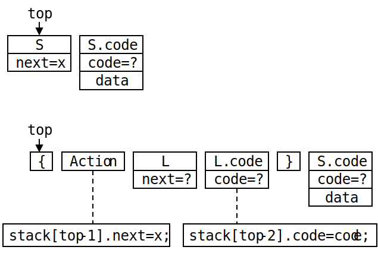

# 编译原理 第 5 章 作业 3

## 1

为下面的产生式写出一个和例 5.19 类似的 L 属性 SDT。这里的每个产生式表示一个常见的 C 语言中那样的控制流结构。你可能需要生成一个三地址语句来跳转到某个标号 L，此时你可以生成语句 $\mathbf{goto} \ L$。

(1) $S \to \mathrm{if} \ (C) \ S_1 \ \mathbf{else} \ S_2$

(2) $S \to \mathbf{do} \ S_1 \ \mathbf{while} \ (C)$

(3) $S \to \text{`}\{\text{'} \ L \ \text{`}\}\text{'};\; L \to  L \ S \mid \varepsilon$

### 解

(1) SDD 如下：

$$
\begin{alignedat}{2}
S &\to \mathrm{if} \ (C) \ S_1 \ \mathbf{else} \ S_2 & \quad
&L_1 = \mathbb{new}();\\
& &
&C.\mathbb{false} = L_1; \\
& &
&S_1.\mathbb{next} = S.\mathbb{next}; \\
& &
&S_2.\mathbb{next} = S.\mathbb{next}; \\
& &
&S.\mathbb{code} =  C.\mathbb{code} \parallel S_1.\mathbb{code} \parallel \mathbf{label} \parallel L_1 \parallel S_2.\mathbb{code} ; \\
\end{alignedat}
$$

对应的 SDT 如下：

$$
\begin{alignedat}{5}
&1)\quad&   S \ &\to&   &\mathbf{if}(&
&\{ &   &L_1 = \mathbb{new}(); C.\mathbb{false} = L_1;\}\\
&       &       &   & \ &C)& \qquad
&\{ &   &S_1.\mathbb{next} = S.\mathbb{next}\}\\
&       &       &   &   &S_1 \ \mathbf{else}& \qquad
&\{ &   &S_2.\mathbb{next} = S.\mathbb{next}\}\\
&       &       &   &   &S_2& \qquad
&\{ &   &S.\mathbb{code} =  C.\mathbb{code} \parallel S_1.\mathbb{code} \parallel \mathbf{label} \parallel L_1 \parallel S_2.\mathbb{code} ; \}\\
\end{alignedat}
$$

(2) SDD 如下：

$$
\begin{alignedat}{2}
S &\to \mathbf{do} \ S_1 \ \mathbf{while} \ (C)  & \quad
&L_1 = \mathbb{new}();\\
& &
&C.\mathbb{false} = S.next \\
& &
&C.\mathbb{true} = L_1; \\
& &
&S.\mathbb{code} =  \mathbf{label} \parallel L_1 \parallel S_1.\mathbb{code}  \parallel C.\mathbb{code} ; \\
\end{alignedat}
$$

对应的 SDT 如下：

$$
\begin{alignedat}{5}
&1)\quad&   S \ &\to&   &\mathbf{do}&
&\{ &   &L_1 = \mathbb{new}(); \}\\
&       &       &   & \ &S_1& \qquad
&\{ &   &C.\mathbb{true} = L_1; \\
&       &       &   &   &   & 
&   &   &C.\mathbb{false} = S.next; \}\\
&       &       &   &   &\mathbf{while}\ (C)& \qquad
&\{ &   &S.\mathbb{code} =  \mathbf{label} \parallel L_1 \parallel S_1.\mathbb{code}  \parallel C.\mathbb{code} ; \}\\
\end{alignedat}
$$

(3)  SDD 如下：

$$
\begin{alignedat}{2}
1)\; S & \to \text{`}\{\text{'} \ L \ \text{`}\}\text{'}  & \quad
&L.\mathbb{next} = S.\mathbb{next};\\
& &
&S.\mathbb{code} =  L.\mathbb{code}; \\
2)\; L & \to L_1 \ S  & \quad
&S.\mathbb{next} = L.\mathbb{next};\\
& &
&L.\mathbb{code} =  L_1.\mathbb{code} \parallel S.\mathbb{code}; \\
3)\; L & \to \varepsilon  & \quad
&\mathbf{if}(L.next)\ \{L.\mathbb{code} = \mathbf{goto} \parallel L.next;\}\\
& &
&\mathbf{else}\ \{L.\mathbb{code} = \varepsilon;\}\\
\end{alignedat}
$$

对应的 SDT 如下：

$$
\begin{alignedat}{5}
&1)\quad&   S \ &\to&   &\text{`}\{\text{'}&
&\{ &   &L.\mathbb{next} = S.\mathbb{next}; \}\\
&       &       &   & \ &L \ \text{`}\}\text{'}&  \qquad
&\{ &   &S.\mathbb{code} =  L.\mathbb{code}; \}\\
&2)\quad&   L \ &\to&   &L_1&
&\{ &   &S.\mathbb{next} = L.\mathbb{next}; \}\\
&       &       &   & \ &S &
&\{ &   &L.\mathbb{code} =  L_1.\mathbb{code} \parallel S.\mathbb{code}; \}\\
&2)\quad&   L \ &\to&   &\varepsilon&
&\{ &   &\mathbf{if}(L.next)\ \{L.\mathbb{code} = \mathbf{goto} \parallel L.next;\}\\
&       &       &   &   & &
&   &   &\mathbf{else}\ \{L.\mathbb{code} = \varepsilon;\}\}\\
\end{alignedat}
$$

## 2

按照 5.5.3 节的风格，将第 1 题中得到的每个 SDT 和一个 LL 语法分析器一起实现，但是代码（或指向代码的指针）存放在栈中。

### 解

(1) 如下图

(2) 如下图

(3) 消除左递归，可以得到

$$
\begin{alignedat}{5}
&1)\quad&   S \ &\to&   &\text{`}\{\text{'}&
&\{ &   &L.\mathbb{next} = S.\mathbb{next}; \}\\
&       &       &   & \ &L \ \text{`}\}\text{'}&  \qquad
&\{ &   &S.\mathbb{code} =  L.\mathbb{code}; \}\\
&2)\quad&   L \ &\to&   &S&
&\{ &   &L_1.\mathbb{next} = L.\mathbb{next}; \}\\
&       &       &   & \ &L_1 &
&\{ &   &L.\mathbb{code} =  S.\mathbb{code} \parallel L_1.\mathbb{code}; \}\\
&2)\quad&   L \ &\to&   &\varepsilon&
&\{ &   &\mathbf{if}(L.next)\ \{L.\mathbb{code} = \mathbf{goto} \parallel L.next;\}\\
&       &       &   &   & &
&   &   &\mathbf{else}\ \{L.\mathbb{code} = \varepsilon;\}\}\\
\end{alignedat}
$$

(3.1) ：

(3.2) ：

(3.3) ：

## 3

按照 5.5.4 节的风格，将第 1 题中得到的每个 SDT 和一个 LR 语法分析器一起实现。

### 解

(1) 如下图

(2) 如下图

(3.1) ：

(3.2) ：

(3.3) ：

