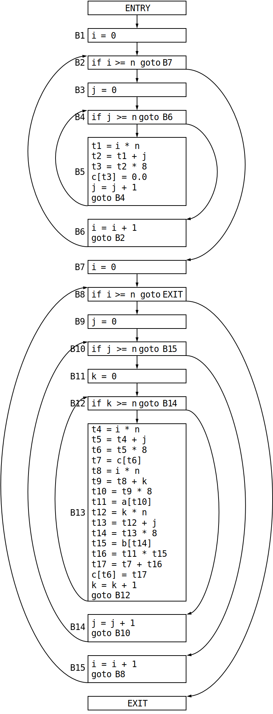
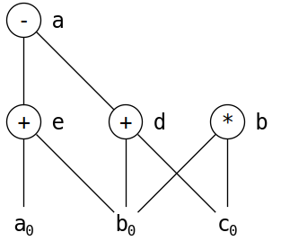

# 编译原理 第 8 章 作业 2

## 1
8.4.1：图 8-10 是一个简单的矩阵乘法程序。

1. 假设矩阵的元素是需要 8 个字节的数值，而且矩阵按行存放。把程序翻译成为我们在本节中一直使用的那种三地址语句；  
2. 为 1. 中得到的代码构造流图；  
3. 找出在 2. 中得到的流图的循环。

图 8-10：一个矩阵乘法程序
```
for (i=0; i<n; i++)
    for (j=0; j<n; j++)
        c[i][j] = 0.0;
for (i=0; i<n; i++)
    for (j=0; j<n; j++)
        for (k=0; k<n; k++)
            c[i][j] = c[i][j] + a[i][k] * b[k][j];
```

### 解

翻译后的三地址语句如下页左侧，构造的流图如下页右侧。

流图中的循环有：
* `{B2, B3, B4, B6}`
* `{B4, B5}`
* `{B8, B9, B10, B15}`  
* `{B10, B11, B12, B14}`
* `{B12, B13}`

<div style="page-break-after: always;"></div>



```
B1    1)    i = 0
B2    2)    if i >= n goto (13)
B3    3)    j = 0
B4    4)    if j >= n goto (11)
B5    5)    t1 = i * n
      1)    t2 = t1 + j
      2)    t3 = t2 * 8
      3)    c[t3] = 0.0
      4)    j = j + 1
      5)    goto (4)
B6    11)   i = i + 1
      1)    goto (2)
B7    13)   i = 0
B8    14)   if i >= n goto (40)
B9    15)   j = 0
B10   16)   if j >= n goto (38)
B11   17)   k = 0
B12   18)   if k >= n goto (36)
B13   19)   t4 = i * n
      1)     t5 = t4 + j
      2)     t6 = t5 * 8
      3)     t7 = c[t6]
      4)     t8 = i * n
      5)     t9 = t8 + k
      6)    t10 = t9 * 8
      7)    t11 = a[t10]
      8)    t12 = k * n
      9)    t13 = t12 + j
      10)   t14 = t13 * 8
      11)   t15 = b[t14]
      12)   t16 = t11 * t15
      13)   t17 = t7 + t16
      14)   c[t6] = t17
      15)   k = k + 1
      16)   goto (18)
B14   36)   j = j + 1
      1)    goto (16)
B15   38)   i = i + 1
      1)    goto (14)

```

<div style="clear: both; page-break-after: always;"></div>

## 2
为下面的基本块构造 DAG，并假设只有 `a` 在基本块出口活跃，简化下述三地址代码
```
d = b + c
e = a + b
b = b * c
a = e - d
```

### 解

构造得到的 DAG 如下：



由于只有 `a` 在基本块出口活跃，三地址代码可简化为：

```
d = b + c
e = a + b
a = e - d
```

