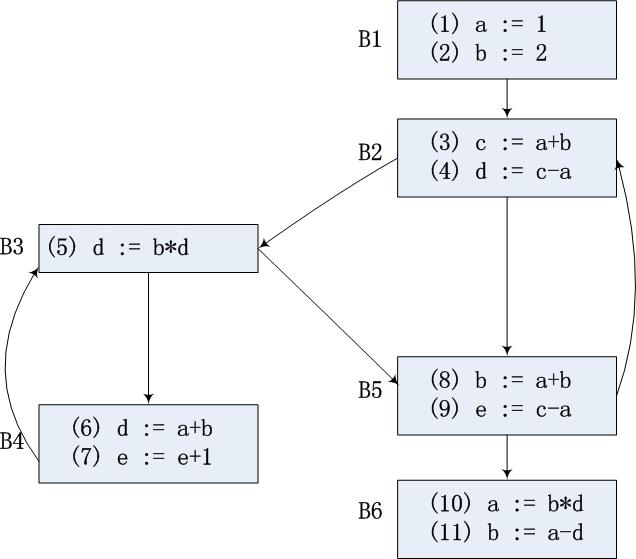

# 编译原理 第 8 章 作业 3

## 1

对下面的流图，计算：

(a) ud 链和 du 链；  
(b) 每块末尾的活跃变量；  
(c) 可用表达式。



### 解

(a) du 链如下：
```
(1)  a: { (3), (4), (6), (8), (9) }
(2)  b: { (3), (5), (6), (8) }
(3)  c: { (4), (9) }
(4)  d: { (5), (10), (11) }
(5)  d: { (10), (11) }
(6)  d: { (5) }
(7)  e: { (7) }
(8)  b: { (3), (5), (6), (8), (10) }
(9)  e: { (7) }
(10) a: { (11) }
(11) b: {  }
```
ud 链如下：
```
(1)
(2)
(3)  a: { (1) }
     b: { (2), (8) }
(4)  c: { (3) }
     a: { (1) }
(5)  b: { (2), (8) }
     d: { (4), (6) }
(6)  a: { (1) }
     b: { (2), (8) }
(7)  e: { (7), (9) }
(8)  a: { (1) }
     b: { (2), (8) }
(9)  c: { (3) }
     a: { (1) }
(10) b: { (8) }
     d: { (4), (5) }
(11) a: { (10) }
     d: { (4), (5) }
```

(b) 每块末尾的活跃变量计算过程如下：
| Block | `def`      | `use`         | `out`               | `in`                |
| :---- | :--------- | :------------ | :------------------ | :------------------ |
| `B1`  | `{ a, b }` | `{  }`        | `{ a, b, e }`       | `{  }`              |
| `B2`  | `{ c, d }` | `{ a, b }`    | `{ a, b, c, d, e }` | `{ a, b, e }`       |
| `B3`  | `{  }`     | `{ b, d }`    | `{ a, b, c, d, e }` | `{ a, b, c, d, e }` |
| `B4`  | `{ d }`    | `{ a, b, e }` | `{ a, b, c, d, e }` | `{ a, b, c, e }`    |
| `B5`  | `{ e }`    | `{ a, b, c }` | `{ a, b, d, e }`    | `{ a, b, c, d }`    |
| `B6`  | `{ a }`    | `{ b, d }`    | `{  }`              | `{ b, d }`          |

故每块末尾的活跃变量如下：
```
out(B1) = { a, b, e }
out(B2) = { a, b, c, d, e }
out(B3) = { a, b, c, d, e }
out(B4) = { a, b, c, d, e }
out(B5) = { a, b, d, e }
out(B6) = {  }
```

(c) 可用表达式计算过程如下：
| Block | `e_kill`                 | `e_gen`        | `in`                 | `out`          |
| :---- | :----------------------- | :------------- | :------------------- | :------------- |
| `B1`  | `{ a+b, c-a, b*d, a-d }` | `{  }`         | `{  }`               | `{  }`         |
| `B2`  | `{ b*d, a-d }`           | `{ a+b, c-a }` | `{  }` B1            | `{ a+b, c-a }` |
| `B3`  | `{ b*d, a-d }`           | `{  }`         | `{ a+b, c-a }` B2 B4 | `{ a+b, c-a }` |
| `B4`  | `{ b*d, a-d, e+1 }`      | `{ a+b }`      | `{ a+b, c-a }` B3    | `{ a+b, c-a }` |
| `B5`  | `{ a+b, b*d, e+1 }`      | `{ c-a }`      | `{ a+b, c-a }` B2 B3 | `{ c-a }`      |
| `B6`  | `{ a+b, c-a, b*d }`      | `{ a-d }`      | `{ c-a }` B5         | `{ a-d }`      |


故每块末尾的可用表达式如下：
```
out(B1) = {  }
out(B2) = { a+b, c-a }
out(B3) = { a+b, c-a }
out(B4) = { a+b, c-a }
out(B5) = { c-a }
out(B6) = { a-d }
```
