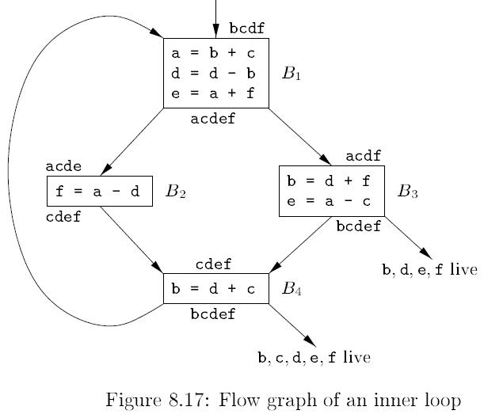
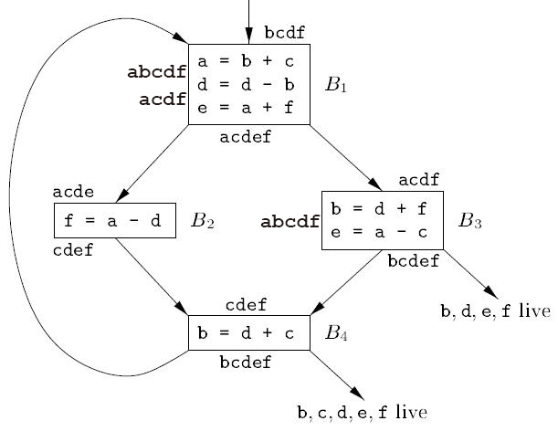
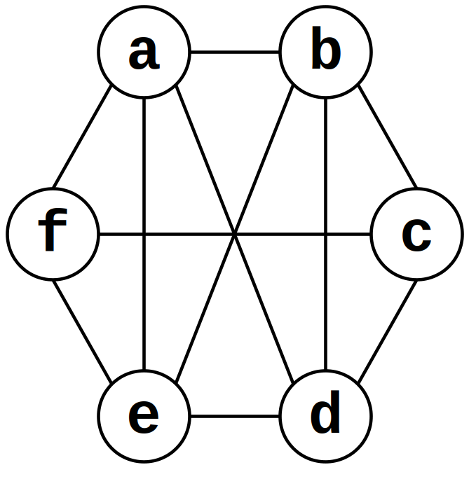

# 编译原理 第 8 章 作业 4

## 1
为下面的每个 C 语言复制语句生成三地址代码：

(1) `x = a + b * c;`  
(2) `a[i] = b[c[i]];`  
(3) `*p++ = *q++`

### 解

(1) `x = a + b * c;`  
```
t1 = b * c
x = x + t1
```

(2) `a[i] = b[c[i]];`
```
t1 = i * 4
t2 = c[t1]
t3 = t2 * 4
t4 = b[t3]
a[t1] = t4
```

(3) `*p++ = *q++`
```
t1 = *q
*p = t1
p = p + 1
q = q + 1
```

## 2
为图 8-17 的程序构造寄存器冲突图（干涉图）。



### 解

程序在各个点的具体活跃情况如下图：



由此可以得到寄存器干涉图：

